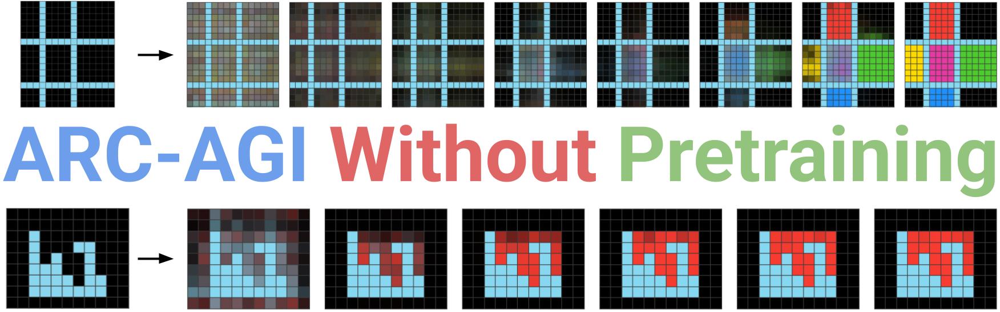

<a href="https://iliao2345.github.io/blog_posts/arc_agi_without_pretraining/arc_agi_without_pretraining.html"></a>
This is the code base for the [ARC-AGI Without Pretraining](https://iliao2345.github.io/blog_posts/arc_agi_without_pretraining/arc_agi_without_pretraining.html) project. The Kaggle competition template version can be found [here](https://www.kaggle.com/code/iliao2345/arc-agi-without-pretraining/notebook?scriptVersionId=232760209).

# Installation

```
> git clone https://github.com/iliao2345/CompressARC.git
> cd CompressARC
> python -m venv arc_agi_without_pretraining
> source arc_agi_without_pretraining/bin/activate
> pip install -r requirements.txt
```

# How to solve an ARC-AGI task

Run `analyze_example.py` to initialize a new model and train from scratch:
```
> python analyze_example.py
Enter which split you want to find the task in (training, evaluation, test): <split>
Enter which task you want to analyze (eg. 272f95fa): <task>
Performing a training run on task <task> and placing the results in <task>/
|100%|███████████████████████████████████████████████| 1500/1500 [12:22<00:00, 2.01it/s]
done
```

The code will create a folder `<task>/` and put plots there after 1500 steps of training:
- solutions at every 50 steps
- interpretable tensors of task representations
- graph of each tensor's contribution to the KL over time
- graph of the KL vs reconstruction error over time

Most tasks may take up to 20 minutes to run, on one NVIDIA GeForce RTX 4070 GPU.


# Tips for Reading the Code

A basic description of the code files in this repo:

**For running via command line:**
- `analyze_example.py`: Demonstrates how to solve one ARC-AGI problem using our method, with visualizations of learned task representations and plots of metrics.
- `plot_problems.py`: Plots all of the ARC-AGI problems in a split.
- `plot_accuracy.py`: Plots pass@n accuracies during/after a bulk training run with `train.py`.
- `train.py`: Trains a model for every task in a split, plotting the accuracy. Contains code that computes the loss function. Defaults to the training split.
- `parallel_train.py`: A multiprocessing program that schedules as many puzzles as possible in a split to be solved at the same time through `solve_task.py`, while maximizing the GPU memory usage. Defaults to the training split.
- `scoring.py`: A script for scoring the results of `parallel_train.py`, which are better-formatted for Kaggle submissions.

**Functionality, not for running via command line:**
- `arc_compressor.py`: The network architecture and forward pass.
- `initializers.py`: Model initialization, and handling of equivariances via weight tying.
- `layers.py`: Implementation of individual layers in the forward pass.
- `multitensor_systems.py`: Handling multitensors.
- `preprocessing.py`: Converting the dataset into a form usable by the repo.
- `solution_selection.py`: Logging metrics and converting model outputs into solution predictions.
- `visualization.py`: Drawing problems and solutions.
- `solve_task.py`: A job script to solve one ARC-AGI problem on a specified GPU.

**Some classes that the repo defines and uses:**
- `MultiTensorSystem` (in `multitensor_systems.py`): A class that can spawn MultiTensors using stored dimensional information.
- `MultiTensor` (in `multitensor_systems.py`): Container class for groups of tensors.
- `Logger` (in `solution_selection.py`): For postprocessing of solutions outputted by the model, and their collection over time during training.
- `Task` (in `preprocessing.py`): Contains information about an ARC-AGI task, such as grid dimensions and masks, pixel colors, etc.
- `ARCCompressor` (in `arc_compressor.py`): Model class, with forward pass.
- `Initializer` (in `initializers.py`): For initializing model weights.

**Some repo-specific language that we use for variable naming, etc.**
- `dims` refers to a length 5 list of zeros and ones, and refers to the presence/absence of each of the five multitensor dimensions $(example, color, direction, height, width)$. Channel dimension is implicitly included.
- `axis` always refers to the index of some dim in a tensor. For example, in a $(example, color, height)$ tensor, the $height$ dim is the 2nd axis, whereas for the $(height, width)$ tensor, it is the 0th axis.
- This repo uses `x` and `y` to refer to the $height$ and $width$ dimensions, respectively.
- The `@multitensor_systems.multify` decorator takes a function and modifies it to apply it once for every tensor in a multitensor. If the input is a tensor/object, then the new input is now a multitensor/multiobject. The function must be written with additional parameter `dims`.
- The `@layers.add_residual` decorator takes a function and creates a residual connection around it, with projections to/from the input/output of the function and the residual stream. Optional parameters are added for using biases for the projections, using pre-norm, and post-norm.
- The `@layers.only_do_for_certain_shapes(*shapes)` decorator takes a function with `dims` as its first input, and applies the function only if `dims` is in `shapes`. Else, it applies the identity function. Useful for chaining with the `@multitensor_systems.multify` decorator.

Code for different files may be written in slightly different styles due to polishing of individual code files by ChatGPT.


# Citation

If you'd like to cite this blog post, use the following entry:
```
@online{liao2025arcagiwithoutpretraining,
	author = {Isaac Liao and Albert Gu},
	title = {ARC-AGI Without Pretraining},
	year = {2025},
	url = {https://iliao2345.github.io/blog_posts/arc_agi_without_pretraining/arc_agi_without_pretraining.html},
}
```
