<a name="topofpage"></a>

This document is about a project we began several months ago to try out a niche perspective in machine learning: that **lossless information compression is sufficient to produce intelligent behavior**. We measured our success using the ARC-AGI dataset, and made an information compression based method that gets 20% on the evaluation set, with the following properties:

- **No pretraining**; models are randomly initialized and trained during test time.
- **No training dataset**; one model trains on one ARC-AGI problem and outputs one solution.
- **No search**, in most senses of the word "search". Just gradient descent.
- 34.75% on training set. (19.45 min per problem, 1x RTX 4070)
- 20% on evaluation set. (20.64 min per problem, 1x RTX 4070)

Our conclusion: even without any external pretraining or large-scale search, lossless information compression (via a VAE) applied directly to each ARC problem is sufficient to grok the solution from the provided examples.

---

## Table of Contents

[Top of Page](#topofpage)
1. [Table of Contents](#table-of-contents)
2. [ARC-AGI as an Information Compression Problem](#arc-agi-as-an-information-compression-problem)
	- [Compression Leads to Intelligence](#compression-leads-to-intelligence)
	- [A Game of Broken Telephone](#a-game-of-broken-telephone)
	- [So what strategy will Alice and Bob use?](#so-what-strategy-will-alice-and-bob-use)
	- [Why does Bob Reconstruct the Correct Solutions to ARC-AGI?](#why-does-bob-reconstruct-the-correct-solutions-to-arc-agi)
	- [How do we Simulate the Game?](#how-do-we-simulate-the-game)
	- [TLDR; The Final Problem Setup](#tldr-the-final-problem-setup)
3. [Architecture](#architecture)
	- [Multitensors](#multitensors)
	- [Decoding Layer](#decoding-layer)
	- [Multitensor Communication Layer](#multitensor-communication-layer)
	- [Softmax Layer](#softmax-layer)
	- [Directional Cummax/Shift Layer](#directional-cummaxshift-layer)
	- [Directional Communication Layer](#directional-communication-layer)
	- [Nonlinear Layer](#nonlinear-layer)
	- [Normalization Layer](#normalization-layer)
	- [Linear Heads](#linear-heads)
4. [Results](#results)
	- [What Problems Can and Can't We Solve?](#what-problems-can-and-cant-we-solve)
	- [Seed Dependence](#seed-dependence)
	- [What if we Remove Directional Layers?](#what-if-we-remove-directional-layers)
5. [Case Study: Problem 272f95fa](#case-study-problem-272f95fa)
	- [Watching the Network Learn (Problem 272f95fa)](#watching-the-network-learn-problem-272f95fa)
	- [Solution Analysis (Problem 272f95fa)](#solution-analysis-problem-272f95fa)
6. [How to Improve Our Work](#how-to-improve-our-work)
	- [Joint Compression via Weight Sharing Between Problems](#joint-compression-via-weight-sharing-between-problems)
	- [Convolution-like Layers for Shape Copying Tasks](#convolution-like-layers-for-shape-copying-tasks)
	- [KL Floor for Posterior Collapse](#kl-floor-for-posterior-collapse)
	- [Regularization](#regularization)
7. [Related Work](#related-work)
	- [Equivalence of Compression and Intelligence](#equivalence-of-compression-and-intelligence)
	- [Information Theory and Coding Theory](#information-theory-and-coding-theory)
	- [Variational Autoencoders](#variational-autoencoders)
	- [ARC-AGI Methods](#arc-agi-methods)
	- [Deep Learning Achitectures](#deep-learning-architectures)
8. [Appendix](#appendix)
	- [Rules for legal multitensors](#rules-for-legal-multitensors)
	- [Weight Tying for Reflection/Rotation Symmetry](#weight-tying-for-reflectionrotation-symmetry)
	- [Preprocessing](#preprocessing)
		- [Output Shape Determination](#output-shape-determination)
		- [Number of Colors](#number-of-colors)
	- [Postprocessing](#postprocessing)
	- [Training](#training)
	- [What Happens to the Representations during Learning](#what-happens-to-the-representations-during-learning)
	- [Additional Case Studies](#additional-case-studies)
		- [Case Study Problem 6d75e8bb](#case-study-problem-6d75e8bb)
			- [Watching the Network Learn (Problem 6d75e8bb)](#watching-the-network-learn-problem-6d75e8bb)
			- [Solution Analysis (Problem 6d75e8bb)](#solution-analysis-problem-6d75e8bb)
		-  [Case Study: Problem 41e4d17e](#case-study-problem-41e4d17e)
			- [Solution Analysis (Problem 41e4d17e)](#solution-analysis-problem-41e4d17e)
	- [List of Mentioned ARC-AGI Tasks](#list-of-mentioned-arc-agi-tasks)
	- [Code](#code)


---

## <a name="formulation"></a>ARC-AGI as an Information Compression Problem

So what do we mean when we say that "the ability to losslessly compress information is sufficient to produce intelligent behavior", and how does that relate to ARC-AGI?

**In short, we believe that lossless compression schemes can be converted into programs for solving ARC-AGI, and the more bit-efficient the compression scheme, the "smarter" the solver program and the more likely it is to give correct solutions.** To use a compressor as an ARC-AGI solver, we figure out the solution grid that when put together with the problem grids, makes the whole task come out to the smallest possible compressed code length. The main challenge is to find a compression scheme that allows for finding this "best solution grid", while maintaining strong bit-efficiency. [We will later find](#tldr-the-final-problem-setup) that a variational autoencoder serves this purpose very well; the compressed code length is equivalent to the loss, and the process of compression is equivalent to training.

#### Compression Leads to Intelligence

Let's restrict "intelligence" to mean "the ability to make decent predictions of unknowns that are determined by complicated mechanisms", for the purposes of this project. This includes the ability to identify and exploit patterns in data for increasing prediction accuracy. In the case of ARC-AGI, an intelligent system would make decent predictions of problem solutions, by identifying and exploiting any complicated input-output mapping rules that it can find and apply to a given problem.

Now, let's describe how a lossless information compression system works. The compression system consists of an encoder and a decoder. The encoder recieves some data, and outputs a bit string that is sent to the decoder, which must then use the string to reproduce the data exactly. We aim to minimize the number of bits sent. For any distribution of data, Shannon's source coding theorem [Shannon's source coding theorem](https://en.wikipedia.org/wiki/Shannon%27s_source_coding_theorem) says that the expected number of bits needed cannot go below the entropy of the data distribution (under certain limits). Any compression system (built specifically for that data distribution) that approaches this lower limit is given the name "entropy coding", and is seen as optimal for that data distribution. If you build a compression system assuming a different data distribution $q$ than the true data distribution $p$, then an entropy coding method will need to use extra bits on average to send data sampled from $p$.

So why is compression sufficient to produce intelligence? Suppose there is a data distribution $p$ that exhibits some patterns, and some of the variables are unknown, which we are trying to predict. If we try to losslessly compress the data by assuming some data distribution $q$ and building an entropy coder, we are going to reach a limit—the entropy of $p$ plus extra bits for $p$'s mismatch with $q$—and then the only way to use fewer bits from there will be to assume a more accurate data distribution $q$ in the first place. That means wherever $p$ has patterns, we must necessarily find those patterns and include them in $q$ to do any better compression. And to do the best possible compression, we need to use *every* pattern in $p$. In the end, this means a system that is good at compression must exploit any patterns in the data that intelligence may find.

**Our solution to ARC-AGI is built upon the assumption that lossless information compression is sufficient for predicting the unknown solutions.**

The below sections describe our thought process and reasoning when building a lossless compression system specifically made for solving ARC-AGI. More details about eliciting intelligence from lossless compression can be found on the [about section of the Hutter Prize website](http://prize.hutter1.net/hfaq.htm#about). (The Hutter Prize is an information compression challenge that encourages people to build AGI.)

#### A Game of Broken Telephone

To make the paradigm of information compression easier to understand, we will describe how we think about ARC-AGI in terms of a communication game. From this point on, we will presume some prior knowledge about information/communications theory, eg. KL divergences.

Suppose Alice wants to send the ARC-AGI dataset to Bob using the fewest number of bits possible,
- Bob must be able to reconstruct all the problems as well as held-out solutions[^-1],
- Bob's reconstructed problems must be correct,
- there is no restriction on what held-out solutions Bob ends up reconstructing,
- both Alice and Bob's computers can run for arbitrarily long amounts of time for encoding and decoding,
- they can agree on a communication protocol before Alice gets to see the ARC-AGI dataset,
- tasks are randomly ordered in the ARC-AGI dataset that Alice must send, (we use "task" here to refer to a problem-solution pair,)
- input-output examples are also randomly ordered in a task,
- every task also gets a random rotation/flip,
- every task also has colors randomly permuted.

Let's say that Alice and Bob are proficient at this game, and they use nearly optimally few bits.

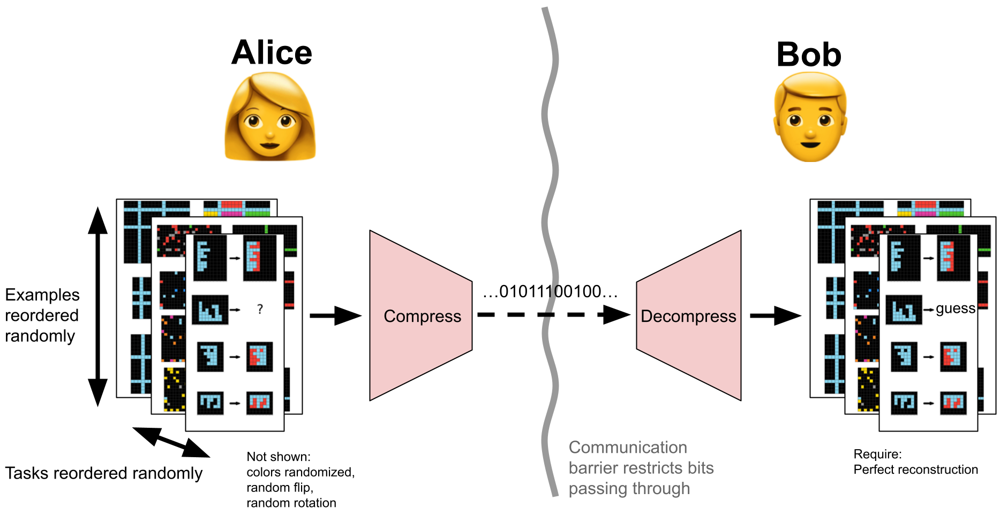

The underlying assumption for our solution to ARC-AGI, is that the held-out solutions that Bob will end up reconstructing, will then be the correct solutions to ARC-AGI. If we can understand the game well enough to find Bob's reconstructions, even without having to solve the rest of the game, then we can solve ARC-AGI.

#### So what strategy will Alice and Bob use?

We can figure out what Bob does first, then we will describe how Alice will behave.

Firstly, let's try to deduce what a reasonable strategy for Bob might be. Let's say that Alice and Bob agree on a strategy Bob should use some particular decoding algorithm $x$ to decode whatever bits $z$ that Alice will send. Then, we can always create an alternate strategy where Bob uses a program executor as the decoding algorithm, and Alice prepends the code for decoding algorithm $x$ to the original bits $z$, for a constant additional cost equal to the length of $x$. As long as $x$ is short in length in comparison to $z$ (ie. roughly, there are more ARC-AGI problems than problem priors), switching Bob's decoding algorithm to a program executor shouldn't incur too much additional cost. So for sake of figuring out what Bob will do, we might as well assume he will decode with a program executor or at least some algorithm that can represent a large space of computations (hmmm - what about a neural network?), because this will almost always be a decently reasonable thing for him to do.

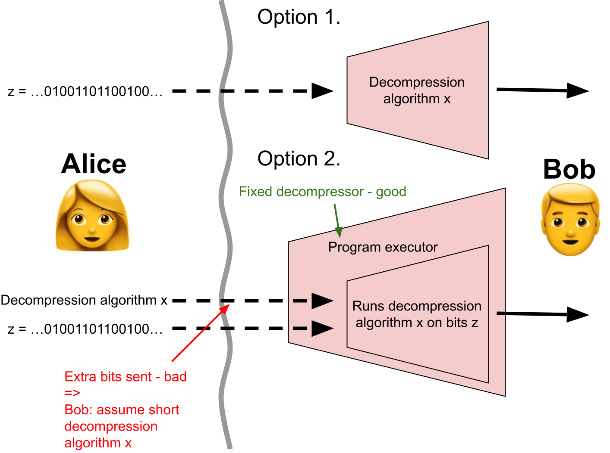

Then when Alice sees the ARC-AGI dataset and needs to communicate it, her job is to write a short-as-possible decompression algorithm $x$, plus a code $z$, to minimize the total length of $x$ and $z$. Thus Bob can assume Alice is more likely to send simpler algorithms $x$ for decoding, and he can define a probability distribution $q$ over $(x, z)$ pairs that assigns a higher probability to shorter total lengths.[^2] Each $(x, z)$ pair describes a decompression algorithm and some compressed bits, but it also equivalently describes a potential ARC-AGI dataset that Bob decodes upon running $x$ on $z$. So, we will use $q$ to refer to both the distribution of $(\text{algorithm}, \text{compressed bits})$ pairs and a distribution of potential ARC-AGI datasets.

Now let's figure out what Alice will do. Suppose Alice and Bob have discussed in advance about some probability distribution $q$. Once they are separated, Alice makes another probability distribution $p$ over the same space, and decides she wants Bob to draw a sample from $p$ (without necessarily knowing $p$). It turns out that Alice can make this happen by sending $KL(p||q)$ bits to Bob[^3], using a technique called [Relative Entropy Coding](https://arxiv.org/abs/2010.01185) (shown below)[^4].


Knowing that this is possible, we will presume that Alice and Bob will use the following strategy, which we believe to be quite close to optimal:
1. Alice and Bob agree on a distribution of ARC-AGI datasets $q$. When Alice is given the actual ARC-AGI problems, she makes a delta distribution on her observed problems. She then picks a distribution of solutions and combines it with the delta distribution to make a distribution $p$ of ARC-AGI datasets. Even though in the $(problem, solution)$ viewpoint $p$ looks like a delta distribution with some other distribution, Alice will be picking the solution distribution by looking from the $(x, z)$ viewpoint where things are much more complicated. She sends a sample from $p$ to Bob, for a cost of $KL(p||q)$, and Bob decodes the ARC-AGI dataset where all the problems are the same as what Alice saw. But Bob will also get solutions drawn from $p$ as a side effect, and these solutions depend on what $(x, z)$ distribution Alice picks.
2. To minimize the KL, Alice realizes that minimizing $KL(p||q)$ is roughly equivalent to minimizing the average total lengths of $x$ and $z$ that she makes $p$ with, since $q$ is weighted to prefer short total lengths. Alice must then figure out what decompression algorithm $x$ and compressed bits $z$ are most efficient to get Bob to correctly decode the ARC-AGI dataset problems she sees. Optimally, Alice must pick the solution distribution to be the conditional distribution $q(\text{solutions}|\text{given problems})$ when she constructs $p$. If Alice can't figure this out exactly and ends up with $q'(\text{solutions}|\text{given problems})$ instead, she will end up constructing a distribution $p$ that incurs an extra KL cost of $KL(q'(\cdot|\text{given problem})|q(\cdot|\text{given problem}))$ on top, which in turn translates to the number of excess bits in the total length of $x$ and $z$. When the conditional distribution $q(\text{solutions}|\text{given problems})$ can't be computed, Alice will still focus on minimizing this excess cost[^5].

#### Why does Bob Reconstruct the Correct Solutions to ARC-AGI?

Remember from before that we are trying to figure out what solutions Bob will reconstruct, presuming from our compression viewpoint that the solutions will be correct. Why should we expect them to be correct in the above protocol?

In step 2, we reason that Alice wants to find short decompression algorithms $x$ that require few compressed bits $z$, to let Bob correctly decode the ARC-AGI problems. If Alice tries to use $z$ to encode both the inputs and outputs in every example, she will incur more cost than if she encodes a small number of per-example variables in $z$, and encodes two short rules to produce the inputs and outputs from the variables, in $x$. Therefore, Bob will "accidentally" end up decoding the held-out solutions by applying a rule to the corresponding inputs. Moreover, Alice's preference for simple rules dictates that the same rule be applied to every example, which means Bob will likely end up with not just any solutions, but the correct ones.[^6] If Alice does her job well and succeeds in finding sufficiently simple rules and bits to send, then she will implicitly send correct solutions to Bob.

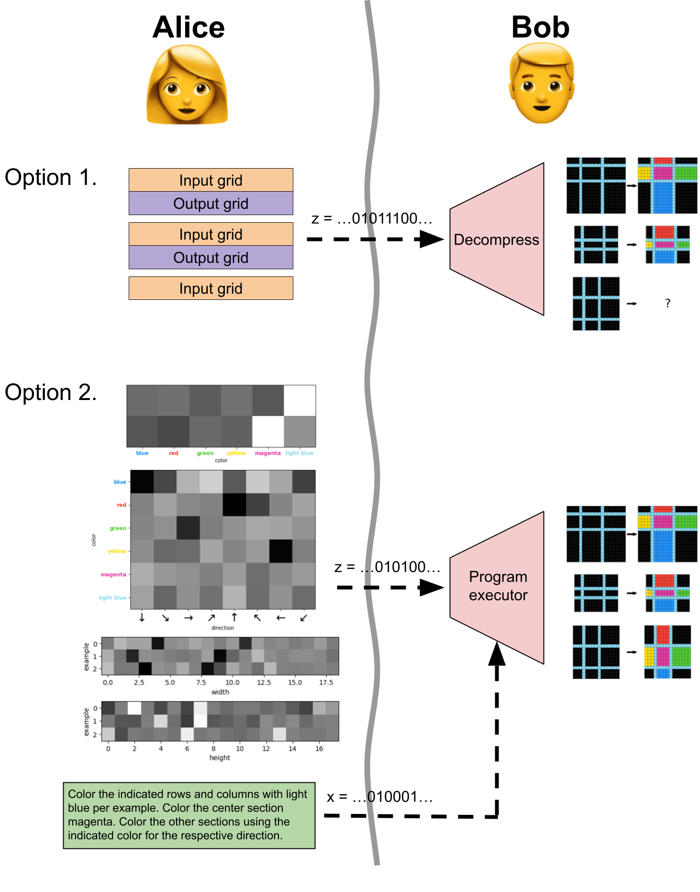

#### How do we Simulate the Game?

Now, what does it take for us to figure out what these solutions will be? We must:
- Construct some kind of distribution $q$ of decoders $x$ and compressed bits $z$.
	- We want the output to be differentiable with respect to both $x$ and $z$, so we'll pick $x$ to be a neural network, and we'll let $z$ be some noisy continuous variables encoded using relative entropy coding. For example, $z$ can include learned images on problem grids. The neural network $x$ then takes the learned grids $z$ as input, and its output is the input/output pairs of all the examples in an ARC-AGI task. This is a lossy reconstruction, but we can treat it as a lossless reconstruction for an additional KL cost equal to the reconstruction error.[^7]
	- By looking at the core knowledge priors and trying some example problems, we can tell that Alice will probably have a decompressor $x$ containing routines for common operations in ARC-AGI, such as shifting a grid by one or swapping some colors. Thus $p$ will be concentrated on datasets using such operations. Then since $KL(p||q)$ doesn't really depend much on the shape of $q$ outside the typical set of $p$, we might as well pick $q$ with support only on the space of decoders which use such operations. This allows us to restrict the massive space of architectures of $x$ we consider to just any one architecture that can perform most of the operations needed for ARC-AGI.
	- Alice will pick $x$ to have operations that are equivariant to augmentation transformations of grids in $z$, so that she can reuse the code for the operations, shortening the length of $x$. Thus, $p$ will concentrate on algorithms $x$ where $p(z|x)$ is equivariant to augmentations of $z$. Like in the previous point, the $KL(p||q)$ doesn't depend much on the shape of $q$ outside the typical set of $p$, so we might as well pick $q$ with support only on the space of neural networks that are equivariant to augmentations of grids. Again, this restricts our choice of neural network architectures.
- We will write an algorithm that, when given the actual ARC-AGI problems, tries to figure out what $p$ Alice will pick, based on two properties: the problems in $p$ match the actual ARC-AGI problems, and Alice tries to minimize $KL(p||q)$. We can use gradient-based optimization for this:
	- We propose some $p$ by picking neural network weights and encodings on grids, measure the reconstruction error on given problems plus the KL, differentiate, and follow the gradient to find the best $p$. The KL will only penalize information in $z$, but information in $x$ (the weights) will be implicitly penalized because we will take a limited number of gradient descent steps.
- When we decode the ARC-AGI problems, we get some guesses for the held-out solutions as a side effect. Those are the solutions that Alice will send to Bob, which we suspect will be correct solutions to ARC-AGI.


One succinct way to describe the above procedure, in standard machine learning terminology, is given in the section below.

#### TLDR; The Final Problem Setup

 - For every ARC-AGI problem, we train a [variational autoencoder](https://arxiv.org/abs/1312.6114)'s decoder side to output the given problem, with no reconstruction error on the held-out solution.[^8]
 - There is no pretraining of the VAEs; the only training data is the given problem.
 - The concept of dataset size breaks down, since there is no batch dimension when training the VAE. If you insist on batches of ARC-AGI problems, then we say the training dataset is of size 1, since there is only one problem for training the VAE. For batches of examples, trying to define "the number of training examples within a problem" is ambiguous, since the VAE also learns to reconstruct the inputs for examples where the solutions are not given.
 - The VAE architecture is constructed so its output distribution is equivariant to many common augmentations of ARC-AGI problems.
 - The posterior distribution of the latent encodings $z$ is not generated by a learned encoder network. Instead, the posterior distribution of $z$ is just a normal distribution whose means and variances are learned tensors.
 - Whatever the VAE decoder outputs in the solution grid(s) is a solution guess that we can use.
 - In each given problem, the VAE groks the answer by learning from the given examples.

The above sections detail the reasoning behind this particular setup, and why we believe it should work.


[1]: We use "problem" to refer to the examples where both inputs and outputs are given, plus the inputs in examples where the held-out outputs aren't given. We use "solution" to refer to only the held-out outputs.
[^2]: We hint at [Solomonoff Induction](https://www.sciencedirect.com/science/article/pii/S0019995864902232) here.
[^3]: A lot of caveats here. The KL is in an expectation, there may be an added constant to the bit cost, the sampling may be approximate, etc. We're not up to date with the current literature, and we're ignoring all the sticky problems that may arise and presuming that they are all solved.
[^4]: We will never need to run Relative Entropy Coding, so it doesn't matter that it takes time that is exponential in the KL. We only make use of the the fact that such algorithms exist, not that they run fast, in order to support our claims.
[^5]: In different language, we may refer to $q$ and $p$ as prior and posterior respectively, and say that Alice tries to approximate a Bayesian update on the [Solomonoff universal prior](http://sciencedirect.com/science/article/pii/S0019995864902232), upon observing the ARC-AGI problems, via [variational inference](https://arxiv.org/abs/1312.6114).
[^6]: Alice may also equivalently encode in $z$ the outputs, plus a rule for corrupting the outputs to make the inputs. This would happen in tasks involving denoising the input. Alternatively she can also try to encode in $z$ some latent variables, plus two rules for getting both the inputs and outputs from the latents. A short and small modification of $x$ can pick between these options.
[^7]: This is because we can apply error table techniques described on [the Hutter Prize webiste][http://prize.hutter1.net/hfaq.htm#lossy].
[^8]: We penalize the reconstruction error by 10x the KL for $z$, in the total KL loss. This isn't detrimental to the measurement of the total KL because the KL term for $z$ can absorb all of the coded information from the reconstruction term, which can then go to zero. Since the term for $z$ is not penalized by any extra factor, the total KL we end up with is then unaffected. We believe this empirically helps because the Gaussians we use for $z$ are not as efficient for storing bits that can be recovered, as the categorical distributions that define the log likelihood in the reconstruction error. Forcing all the coded bits into one storage mode removes pathologies introduced by multiple storage modes.

---

## Architecture

We designed our own neural network architecture to solve ARC-AGI via [the problem setup above](#tldr-the-final-problem-setup).


Components:
- Begin with posterior distribution $p$,
- [Decoding Layer](#decoding-layer)
- 4x
	- [Multitensor Communication Layer, Upwards](#multitensor-communication-layer)
	- [Softmax Layer](#softmax-layer)
	- [Directional Cummax Layer](#directional-cummaxshift-layer)
	- [Directional Shift Layer](#directional-cummaxshift-layer)
	- [Directional Communication Layer](#directional-communication-layer)
	- [Nonlinear Layer](#nonlinear-layer)
	- [Multitensor Communication Layer, Downwards](#multitensor-communication-layer)
	- [Normalization Layer](#normalization-layer)
- [Linear Heads](#linear-heads)

The fundamental data format passed between the layers of our architecture is something we will call a "multitensor". **In order to understand any of the layers listed above, you must first read the below section on multitensors.**

#### Multitensors

Most common classes of machine learning architectures operate on a single type of tensor with constant rank. LLMs operate on rank 3 tensors of shape $[n\_batch, n\_tokens, n\_channels]$, and CNNs operate on a rank 4 tensors of shape $[n\_batch, n\_channels, height, width]$. Our multitensors are a set of varying-rank tensors of unique type, whose dimensions are a subset of a rank 6 tensor of shape $[n\_examples, n\_colors, n\_directions, height, width, n\_channels]$. We always keep the channel dimension, so there are at most 32 tensors in every multitensor. We also maintain [several rules](#rules-for-legal-multitensors) that determine whether a tensor shape is "legal" or not, which reduces the number of tensors in a multitensor to 18.

| Dimension | Size                                                                                                                             |
| --------- | -------------------------------------------------------------------------------------------------------------------------------- |
| Example   | Number of examples in the ARC-AGI task                                                                                           |
| Color     | Number of unique colors in the ARC-AGI task, [not including black](#number-of-colors)                                            |
| Direction | 8                                                                                                                                |
| Height    | [Determined by preprocessing](#output-shape-determination)                                                                       |
| Width     | [Determined by preprocessing](#output-shape-determination)                                                                       |
| Channel   | In the residual connections, the size is 8 if the direction dimension is included, else 16. Within layers it is layer-dependent. |

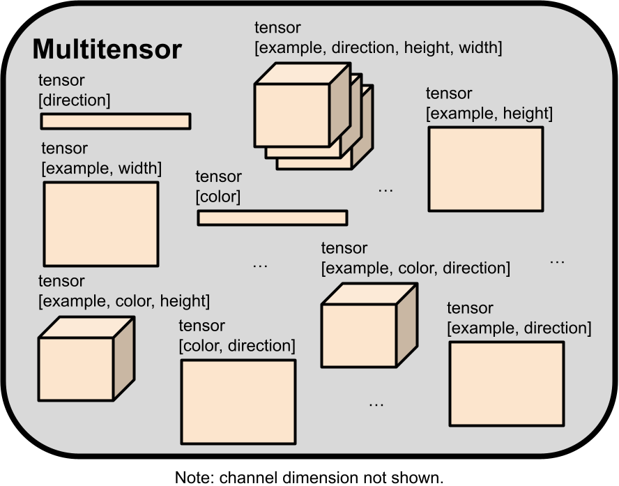

To give an idea of how a multitensor stores data, an ARC-AGI task can be represented by using the $[examples, colors, height, width, channel]$ tensor, by using the channel dimension to select either the input or output grid, and the width/height dimensions for pixel location, a one hot vector in the color dimension, specifying what color that pixel is. The $[examples, width, channel]$ and $[examples, height, channel]$ tensors can similarly be used to store masks representing grid shapes for every example for every input/output grid. All those tensors are included in a single multitensor that is computed by the network just before the final [linear heads](#linear-heads) layer.

Some layers require an object for every tensor in a multitensor, so when talking about sets of objects all corresponding to the same multitensor, we may use the prefix "multi". For example, we may say "multiweights" when talking about using a linear layer with separate weights for every tensor in a multitensor.

When we apply an operation on a multitensor, we by default assume that all non-channel dimensions are treated identically as batch dimensions by default. The operation is copied across the indices of dimensions unless specified. For example, we will see later that the [directional shift layer](#directional-cummaxshift-layer) treats the example and color dimensions as batch dimensions, as it operates using the rest of the dimensions.

Usually when talking about a tensor's shape, we will not mention the channel dimension as it is included by default.

#### Decoding Layer

The decoding layer's job is to sample and bound the information content of a multitensor $z$, before it is passed to the next layer. This layer and outputs the KL divergence between the learned $z$ distribution and a presumed distribution. Penalizing the KL prevents the network from learning a distribution for $z$ that memorizes the ARC-AGI task in an uncompressed fashion, and forces it to represent the task more succinctly.

This layer takes as input:
 - A learned target multiscalar, called the "target capacity".[^9] The decoding layer will output $z$ whose information content per tensor is close to the target capacity,[^10]
 - learned per-element means for $z$,[^11]
 - learned per-element capacity adjustments for $z$.

We begin by normalizing the learned per-element means for $z$.[^12] Then, we figure out how much Gaussian noise we must add into every tensor, in order to get signal-to-noise ratios such that the channel capacity of this noising operation will be equal to the target capacity for every tensor (adjusted by the learned per-element capacity adjustments). We add in this noise to get a sample of $z$, keeping unit variance in $z$ by rescaling.[^13]

We compute the information content of $z$ as the KL divergence between the distribution of this sample and $N(0,1)$.

Finally, we postprocess the noisy $z$ by scaling it by the sigmoid of the signal-to-noise ratio.[^14] This ensures that $z$ is kept as-is when its variance consists mostly of useful information and it is nearly zero when its variance consists mostly of noise. All this is done 4 times to make a channel dimension of 4. Then we apply a multilinear layer, ie. a linear layer with different weights per tensor in the multitensor, mapping the channel dimension up to the dimension of the residual stream.

#### Multitensor Communication Layer

The multitensor communication layers allow different tensors in a multitensor to interact with each other. This layer is surrounded by a residual connection.

A multilinear layer first applies a multilinear layer to down-project the channel dimension to a fixed size (8 for downwards communication and 16 for upwards communication). Then a message is sent to every other tensor that has at least the same dimensions for upwards communication, or at most the same dimensions for downwards communication. This message is created by either taking means along dimensions to remove them, or inserting/unsqueezing dimensions to add them. All the messages received by every tensor are summed together and normalization is applied. This result gets up-projected back to the residual's dimension and then added to the residual.

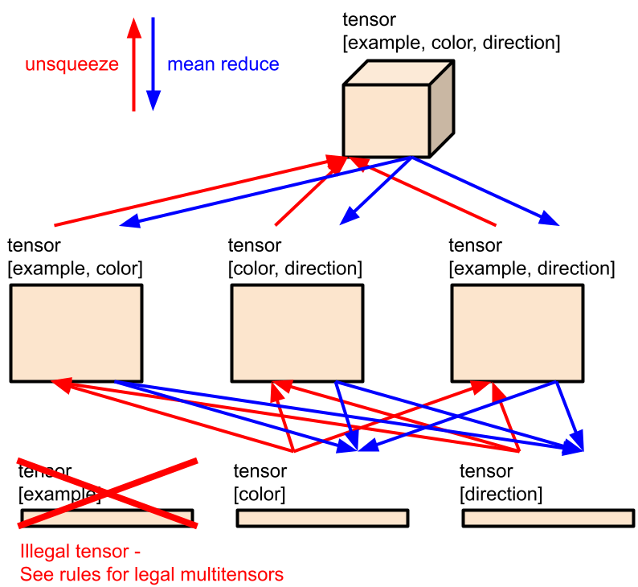

#### Softmax Layer

The softmax layers allow the network to denoise and sharpen internal representations that the network may intend to keep as one-hot. The softmax layers are surrounded by down- and up- multiprojections, pre-norm, and a residual connection.

For every tensor in the multitensor input of channel dimension 2, the softmax layer lists out all the possible subsets of dimensions of the tensor to take a softmax over[^15], takes the softmax over these subsets of dimensions, and concatenates all the results together in the channel dimension. Thus, the output dimension varies across different tensors in the multitensor.

#### Directional Cummax/Shift Layer

The directional cummax and shift layers allow the network to perform different operations in the upward direction than in the downward direction, and similarly for left and right, and so on, before information from opposite directions is aggregated together once again. These layers are equivariant to flipping the grids, as long as we also swap the indices of the direction dimension. These layers are surrounded by a residual connection. They have multilinears before and after to down- and up- project to and from a dimension of 4, and normalization right before the up-projection. These layers are only applied to the $[example, color, direction, height, width, channel]$ and $[example, direction, height, width, channel]$ tensors in the multitensor.

The directional cummax layer takes the eight indices of the direction dimension, treats each slice as corresponding to one direction (4 cardinal, 4 diagonal), performs a cumulative max in the respective direction for each slice, does it in the opposite direction for half the channels, and stacks the slices back together in the direction dimension.

The directional shift layer does the same thing, but for shifting the grid by one pixel, instead of applying the cumulative max.

For the cumulative max but not the shift, the slices are rescaled to have min $-1$ and max $1$ before applying the cumulative max.


#### Directional Communication Layer

The directional communication layers allow the network to make use of relationships between directions. It provides a way for tensors that have direction-specific information to send information between two slices in the direction dimension, dependent on the angular difference the slices represent. This layer defines a separate linear map to be used for each of the 64 possible combinations of angles, but the weights of the linear maps are minimally tied such that the directional communication layer is equivariant to reflections and rotations (given that the indices of the direction dimension also permute accordingly). Sometimes, this also means that [weights for different tensors in the multitensor are tied together as well](#weight-tying-for-reflectionrotation-symmetry). Every direction slice in a tensor accumulates 8 messages, and adds the results together.[^16]

The directional communication layers of channel dimension of 2 are surrounded by down- and up- multiprojections, pre-norm, and a residual connection.

#### Nonlinear Layer

We use a SiLU nonlinearity with channel dimension 16, surrounded by down- and up- multiprojections, pre-norm, and a residual connection.

#### Normalization Layer

We normalize all the tensors in the multitensor, using means and variances computed across all dimensions except the channel dimension. Normalization as used within other layers also generally operates this way.

#### Linear Heads

We must take the final multitensor, and convert it to the format of an ARC-AGI task. More specifically, we must convert the multitensor into a distribution over ARC-AGI tasks, so that we can compute the log-likelihood of the observed grids in the task.


The colors of every pixel for every example for both input and output, have logits defined by the $[examples, colors, height, width, channel]$ tensor, with the channel dimension linearly mapped down to a size of 2, representing the input and output grids.[^17] The log-likelihood is given by the crossentropy, with sum reduction across all the grids.

For grids of non-constant shape, the $[examples, width, channel]$ and $[examples, height, channel]$ tensors are used to create distributions over possible contiguous rectangular slices of each grid of colors. Again, the channel dimension is mapped down to a size of 2 for input and output grids. For every grid, we have a vector of size $[width]$ and a vector of size $[height]$. The log likelihood of every slice of the vector is taken to be the sum of the values within the slice, minus the values outside the slice. The log likelihoods for all the possible slices are then normalized to have total probability one, and the colors for every slice are given by the color logits defined in the previous paragraph.

With the ARC-AGI task distribution now defined, we can now evaluate the log-likelihood of the observed ARC-AGI task, to use as the reconstruction error.[^18]


[^9]: Target capacities are exponentially parameterized and rescaled by 10x to increase sensitivity to learning, initialized at a constant $10^4$ nats per tensor, and forced to be above a minimum value of half a nat.
[^10]: The actual information content, which the layer computes later on, will be slightly different because of the per-element capacity adjustments.
[^11]: Means are initialized using normal distribution of variance $10^{-4}$.
[^12]: Means and variances for normalization are computed along all non-channel dimensions.
[^13]: There are many caveats with the way this is implemented and how it works; please refer to the [code](#code) if you want more details.
[^14]: We are careful not to let the postprocessing operation, which contains unbounded amounts of information via the signal-to-noise ratios, to leak lots of information across the layer. We only let a bit of it leak by averaging the signal-to-noise ratios across individual tensors in the multitensor.
[^15]: One exception: we always include the example dimension in the subset of dimensions.
[^16]: We also multiply the results by coefficients depending on the angle: 1 for 0 degrees and 180 degrees, 0.2 for 45 degrees and 135 degrees, and 0.4 for 90 degrees.
[^17]: The linear map is initialized to be identical for both the input and output grid, but isn't fixed this way during learning. Sometimes this empirically helps with problems of inconsistent grid shapes. The bias on this linear map is multiplied by 100 before usage, otherwise it doesn't seem to be learned fast enough empirically. This isn't done for the shape tensors described by the following paragraph though.
[^18]: There are multiple slices of the same shape that result in the correct ARC-AGI task to be decoded. We sum together the probabilities of getting any of the slices by applying a logsumexp to the log probabilities. But, we found empirically that training prematurely collapses onto one particular slice. So, we pre-multiply and post-divide the log probabilities by a coefficient when applying the logsumexp. The coefficient starts at 0.1 and increases exponentially to 1 over the first 100 iterations of training. We also pre-multiply the masks by the square of this coefficient as well, to ensure they are not able to strongly concentrate on one slice too early in training.

---

## Results

###### Training set: 34.75%


| iteration | time    | pass@1 | pass@2 | pass@5 | pass@10 | pass@100 | pass@1000 |
| --------- | ------- | ------ | ------ | ------ | ------- | -------- | --------- |
| 100       | 6.48h   | 0.01   | 0.0225 | 0.035  | 0.0475  | 0.0675   | 0.0675    |
| 200       | 12.97h  | 0.115  | 0.1425 | 0.165  | 0.1825  | 0.2325   | 0.235     |
| 300       | 19.45h  | 0.185  | 0.2125 | 0.235  | 0.2675  | 0.315    | 0.325     |
| 400       | 25.93h  | 0.21   | 0.25   | 0.2875 | 0.31    | 0.36     | 0.375     |
| 500       | 32.42h  | 0.23   | 0.275  | 0.315  | 0.335   | 0.3925   | 0.4075    |
| 750       | 48.62h  | 0.28   | 0.305  | 0.34   | 0.3625  | 0.4275   | 0.445     |
| 1000      | 64.83h  | 0.28   | 0.3175 | 0.355  | 0.3775  | 0.4375   | 0.465     |
| 1250      | 81.04h  | 0.29   | 0.3225 | 0.37   | 0.3925  | 0.455    | 0.4925    |
| 1500      | 97.25h  | 0.295  | 0.33   | 0.3825 | 0.4075  | 0.4675   | 0.5175    |
| 2000      | 129.66h | 0.3025 | 0.3475 | 0.3825 | 0.415   | 0.485    | 0.5275    |

###### Evaluation set: 20%


| iteration | time    | pass@1 | pass@2 | pass@5 | pass@10 | pass@100 | pass@1000 |
| --------- | ------- | ------ | ------ | ------ | ------- | -------- | --------- |
| 100       | 6.88h   | 0.0075 | 0.0125 | 0.0225 | 0.025   | 0.03     | 0.03      |
| 200       | 13.76h  | 0.05   | 0.06   | 0.07   | 0.0775  | 0.12     | 0.1225    |
| 300       | 20.64h  | 0.1    | 0.1075 | 0.1225 | 0.1325  | 0.155    | 0.1625    |
| 400       | 27.53h  | 0.1175 | 0.1375 | 0.16   | 0.17    | 0.1975   | 0.2       |
| 500       | 34.41h  | 0.135  | 0.15   | 0.1775 | 0.1925  | 0.205    | 0.215     |
| 750       | 51.61h  | 0.155  | 0.1775 | 0.1975 | 0.215   | 0.2275   | 0.255     |
| 1000      | 68.82h  | 0.1675 | 0.1925 | 0.2175 | 0.23    | 0.26     | 0.2875    |
| 1250      | 86.02h  | 0.17   | 0.2075 | 0.23   | 0.245   | 0.2825   | 0.3075    |
| 1500      | 103.22h | 0.1825 | 0.215  | 0.2425 | 0.255   | 0.295    | 0.3175    |
| 2000      | 137.63h | 0.185  | 0.2    | 0.2425 | 0.26    | 0.3125   | 0.3375    |

#### What Problems Can and Can't We Solve?

**The network tries to use its abilities to figure out as much as it can, until it gets bottlenecked by one of it's inabilities.**

For example, task 28e73c20 in the training set requires extension of a pattern from the edge towards the middle:


In general, the network is able to extend patterns for short ranges but not long ranges. So, it does the best that it can, and correctly extends the pattern a short distance before guessing at what happens near the center:

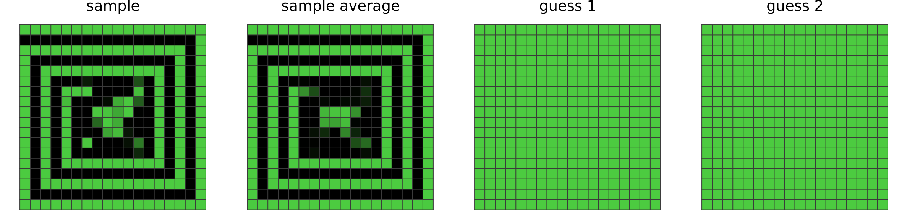

A short list of abilities that can be performed by our network includes:
- Assigning individual colors to individual procedures (see problem [0ca9ddb6](#list-of-mentioned-arc-agi-tasks))
- Infilling (see problem [0dfd9992](#list-of-mentioned-arc-agi-tasks))
- Cropping (see problem [1c786137](#list-of-mentioned-arc-agi-tasks))
- Connecting dots with lines, including 45 degree diagonal lines (see problem [1f876c06](#list-of-mentioned-arc-agi-tasks))
- Same color detection (see problem [1f876c06](#list-of-mentioned-arc-agi-tasks))
- Identifying pixel adjacencies (see problem [42a50994](#list-of-mentioned-arc-agi-tasks))
- Assigning individual colors to individual examples (see problem [3bd67248](#list-of-mentioned-arc-agi-tasks))
- Identifying parts of a shape (see problem [025d127b](#list-of-mentioned-arc-agi-tasks))
- Translation by short distances (see problem [025d127b](#list-of-mentioned-arc-agi-tasks))

A short list of abilities that cannot be performed by our network includes:
- Assigning two colors to each other (see problem [0d3d703e](#list-of-mentioned-arc-agi-tasks))
- Repeating an operation in series many times (see problem [0a938d79](#list-of-mentioned-arc-agi-tasks))
- Counting/numbers (see problem [ce9e57f2](#list-of-mentioned-arc-agi-tasks))
- Translation, rotation, reflections, rescaling, image duplication (see problems [0e206a2e](#list-of-mentioned-arc-agi-tasks), [5ad4f10b](#list-of-mentioned-arc-agi-tasks), and [2bcee788](#list-of-mentioned-arc-agi-tasks))
- Detecting topological properties such as connectivity (see problem [7b6016b9](#list-of-mentioned-arc-agi-tasks))
- Planning, simulating the behavior of an agent (see problem [2dd70a9a](#list-of-mentioned-arc-agi-tasks))
- Long range extensions of patterns (see problem 28e73c20 above)

#### Seed Dependence

While developing and testing the layers of our network, we found that in some runs, a task would never be solved even after 2000 iterations might easily be solved in 300 iterations after rerunning the same code (eg. we saw this extensively in task [272f95fa](#case-study-problem-272f95fa)). This makes us wonder how many of the tasks are solved consistently and how many are lucky breaks.

So, we re-ran the training set and found the following overlap of solved tasks:

TODO venn diagram of solved tasks. Do for @1, do for @2.

We can also create an improved model by training two models in parallel and [selecting the top k solutions found](#postprocessing) for our top-k accuracy. This indeed gives us a better performance at TODO% on the training set, for twice the training time:


TODO correct numbers in table below

| iteration | time    | pass@1 | pass@2 | pass@5 | pass@10 | pass@100 | pass@1000 |
| --------- | ------- | ------ | ------ | ------ | ------- | -------- | --------- |
| 100       | 6.88h   | 0.0075 | 0.0125 | 0.0225 | 0.025   | 0.03     | 0.03      |
| 200       | 13.76h  | 0.05   | 0.06   | 0.07   | 0.0775  | 0.12     | 0.1225    |
| 300       | 20.64h  | 0.1    | 0.1075 | 0.1225 | 0.1325  | 0.155    | 0.1625    |
| 400       | 27.53h  | 0.1175 | 0.1375 | 0.16   | 0.17    | 0.1975   | 0.2       |
| 500       | 34.41h  | 0.135  | 0.15   | 0.1775 | 0.1925  | 0.205    | 0.215     |
| 750       | 51.61h  | 0.155  | 0.1775 | 0.1975 | 0.215   | 0.2275   | 0.255     |
| 1000      | 68.82h  | 0.1675 | 0.1925 | 0.2175 | 0.23    | 0.26     | 0.2875    |
| 1250      | 86.02h  | 0.17   | 0.2075 | 0.23   | 0.245   | 0.2825   | 0.3075    |
| 1500      | 103.22h | 0.1825 | 0.215  | 0.2425 | 0.255   | 0.295    | 0.3175    |
| 2000      | 137.63h | 0.185  | 0.2    | 0.2425 | 0.26    | 0.3125   | 0.3375    |

#### What if we Remove Directional Layers?

The directional layers may seem overengineered, and they have little in the way of wider purpose towards AGI, only serving to increase our score on the ARC-AGI dataset. Here, we show that removing these layers hurts performance in a predictable way:
- Some abilities of our network disappear, namely the ones that require on row/column ordering to be well defined. Eg. Infilling, connecting dots with lines, pixel adjacencies.
- Abilities that remain sensible when rows and columns are permuted are unaffected.

To test the effects of directional layers, we removed the directional layers and changed the multitensor definition to make tensors with a direction axis [illegal](#rules-for-legal-multitensors), and re-ran training. Below are three tasks that can still be solved,

| TODO problem+solution | TODO problem+solution | TODO problem+solution |
| --------------------- | --------------------- | --------------------- |

and three tasks that can no longer be solved,

| TODO problem+failed solution | TODO problem+failed solution | TODO problem+failed solution |
| ---------------------------- | ---------------------------- | ---------------------------- |

The new non-directional network runs much faster but only gets TODO%.


TODO correct numbers in table below

| iteration | time    | pass@1 | pass@2 | pass@5 | pass@10 | pass@100 | pass@1000 |
| --------- | ------- | ------ | ------ | ------ | ------- | -------- | --------- |
| 100       | 6.88h   | 0.0075 | 0.0125 | 0.0225 | 0.025   | 0.03     | 0.03      |
| 200       | 13.76h  | 0.05   | 0.06   | 0.07   | 0.0775  | 0.12     | 0.1225    |
| 300       | 20.64h  | 0.1    | 0.1075 | 0.1225 | 0.1325  | 0.155    | 0.1625    |
| 400       | 27.53h  | 0.1175 | 0.1375 | 0.16   | 0.17    | 0.1975   | 0.2       |
| 500       | 34.41h  | 0.135  | 0.15   | 0.1775 | 0.1925  | 0.205    | 0.215     |
| 750       | 51.61h  | 0.155  | 0.1775 | 0.1975 | 0.215   | 0.2275   | 0.255     |
| 1000      | 68.82h  | 0.1675 | 0.1925 | 0.2175 | 0.23    | 0.26     | 0.2875    |
| 1250      | 86.02h  | 0.17   | 0.2075 | 0.23   | 0.245   | 0.2825   | 0.3075    |
| 1500      | 103.22h | 0.1825 | 0.215  | 0.2425 | 0.255   | 0.295    | 0.3175    |
| 2000      | 137.63h | 0.185  | 0.2    | 0.2425 | 0.26    | 0.3125   | 0.3375    |


---

## Case Study: Problem 272f95fa

Let's demonstrate the inner workings of our model using an example ARC-AGI task. Problem 272f95fa is part of the training split.


#### Watching the Network Learn (Problem 272f95fa)

###### After 50 steps of training:

The network outputs a solution that has two rows and columns highlighted in blue, in the same place where the input has rows and columns in blue. This is probably because the network has noticed that all the other given input/output pairs have this correspondence. The network doesn't know how the other pixels are assigned their colors, as can be observed from the random coloring of remaining pixels in the sample. The sample average shows the network assigns mostly the same average color to non-light-blue pixels.

###### After 150 steps of training:

The sample shows nearby pixels being similar colors. The network has likely noticed that this is a common property among all the outputs, and is guessing that it applies to the held-out output too.

###### After 200 steps of training:

The sample now shows colors that are uniform(ish) within boxes outlined by the light blue borders, and the color consistency among nearby pixels ends at these borders. The network has noticed the common usage of borders to delineate colors in other outputs, and applies the same logic here. The network has also realized that all of the given outputs have black corner sections, so the sample now shows the same.

###### After 350 steps of training:

The sample now shows the correct colors assigned to boxes of the correct direction relative to the center box. The network has realized that the same color-to-direction mapping is used to pick the colors of boxes in all the other outputs, so it uses the same mapping here. It is still not the best at coloring within the lines, and also messes up the center box, as the middle does not correspond to a direction. Nonetheless, the sample average does show a tinge of the correct magenta color in the middle, indicating that the network is catching on. The postprocessing/guessing mechanism has picked from the network a solution with magenta in the middle.

###### After 1500 steps of training:

The network is as refined as it will ever be. Sometimes it will still make a mistake in the sample it outputs, but this is easily recognized as noise by the postprocessing/guessing mechanism.

During training, the reconstruction error fell extremely quickly. It remained low on average, but would spike up every once in a while, causing the KL from $z$ to bump upwards at these moments.


#### Solution Analysis (Problem 272f95fa)

So how does the network learn to solve the task? Let's look at the representations stored in $z$ to find out.

Since $z$ is a [multitensor](#multitensors), each of the tensors it contains produces an additive contribution to the total KL for $z$. By looking at the per-tensor contributions, we can determine which tensors in $z$ code for information that is used to represent the ARC-AGI task. Below is a plot showing the quantity of information stored in each tensor of $z$, ie. the KL contribution used by the [decoding layer](#decoding-layer).


All the tensors fall to zero information content during training, except for four tensors. In some replications of this experiment, we saw one of these four necessary tensors fall to zero information content, and the network typically does not recover the correct solution after that. Here we are showing a lucky run where the $(color, direction, channel)$ tensor almost falls but gets picked up 200 steps in, which is right around when the samples from the model begin to show the correct colors in the correct boxes. We can look at the average output of the [decoding layer](#decoding-layer) for these tensors to see what information is stored there.

###### (Examples, height, channel) tensor:
For every example and row, there is a vector of dimension $n\_channels$. This forms a dataset of vectors. Taking the PCA of these vectors, the top principal component can tell us which examples/row combinations are uniquely identified by the stored information.
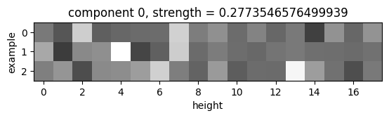
It is 1485 times stronger than the second principal component, which indicates to us that basically all of the information is in the above tensor. **For every example, the two brightest pixels give the rows where the light blue rows in the problem are.**

###### (Examples, width, channel) tensor:
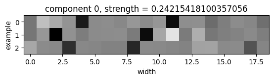
A very similar story here: **the two darkest pixels for every example give the columns where the light blue columns in the problem are.** The top principal component is 1253 times stronger than the next principal component.

###### (Direction, color, channel) tensor:
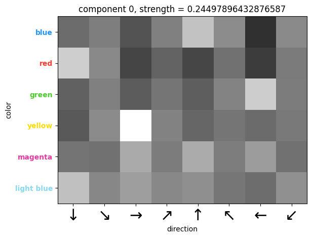
Here, we see that the four brightest pixels identify blue with up, green with left, red with down, and yellow with right. **This tensor seems to tell each direction which color to use for the opposite direction's corresponding box.** The top principal component is 829 times stronger than the next principal component.

###### (Color, channel) tensor:
Here, we look at the top three principal components, since the first and second principal components are 134 and 87 times stronger than the third component, indicating that they play a role while the third component does not.
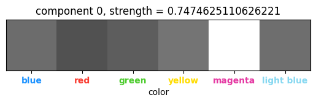
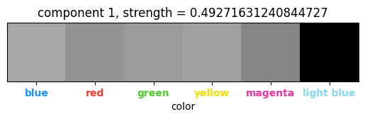
The **magenta and light blue colors** are uniquely identified, indicating their special usage amongst the rest of the colors as **the center color and the color of the row/column divisions**, respectively.


---

## How to Improve Our Work

At the time of release of this project, there were several ideas which we thought of trying or attempted at some point, but didn't manage to get working for one reason or another. Some ideas we still believe in, but didn't use, are listed below.

#### Joint Compression via Weight Sharing Between Problems

Our current system tries to solve each problem serially by compressing each problem on its own. We believe that joint compression of all the entire ARC-AGI dataset at once should yield better learned inductive biases per-problem, since computations learned for one problem can be transferred to other problems. We do not account for the size of $x$ in our [problem formulation](#so-what-strategy-will-alice-and-bob-use), allowing for $x$ to be used for memorization/overfitting. By jointly compressing the whole dataset, we only need to have one $x$, whereas when compressing each problem individually, we need to have an $x$ for every problem, allowing for more memorization/overfitting.

To implement this, we would most likely explore strategies like:
- Using the same network weights for all problems, and training problems in parallel. Each problem gets assigned some perturbation to the weights, that is constrained in some way.
- Learning a "problem code" for every problem that is a high dimensional vector (more than 16 dim, less than 256 dim), and learning a linear mapping from problem code to weights for our network. This mapping serves as a basic [hypernetwork](https://arxiv.org/abs/2306.06955), ie. a neural network that outputs weights for another neural network.
In a successful case, we might want to also try adding in some form of positional encodings, with the hope that $x$ is now small enough to be incapable of memorization/overfitting using positional encodings.

The reason we didn't try this is because it would slow down the research iteration process.

#### Convolution-like Layers for Shape Copying Tasks

This one is more ARC-AGI-specific and may have less to do with AGI in our view. Many ARC-AGI tasks can be seen to involve copying shapes from one place to another, and our network has no inductive biases for such an operation. An operation which is capable of copying shapes onto multiple locations is the [convolution](https://en.wikipedia.org/wiki/Convolution). With one grid storing the shape and another with pixels activated at locations to copy to, convolving the two grids will produce another grid with the shape copied to the designated locations.

There are several issues with introducing a convolutional operation for the network to use. Ideally, we would read two grids via projection from the residual stream, convolve them, and write it back in via another projection, with norms in the right places and such. Ignoring the fact that the grid size changes during convolution (can be solved with two parallel networks using different grid sizes), the bigger problem is that convolutions tend to amplify noise in the grids much more than the sparse signals, so their inductive bias is not good for shape copying. We can try to apply a softmax to one or both of the grids to reduce the noise (and to draw an interesting connection to attention), but we didn't find any success.

The last idea that we were tried before discarding the idea was to modify the functional form of the convolution:
$$(f * g)(x) = \sum_y f(x-y)g(y)$$
to [a tropical convolution](https://arxiv.org/abs/2103.02096), which we found to work well on toy tasks, but not well enough for ARC-AGI training set tasks (which is why we discarded this idea):
$$(f*g)(x) = \max_y f(x-y) + g(y)$$
Convolutions, when repeated with some grids flipped by 180 degrees, tend to create high activations at the center pixel, so sometimes it is important to zero out the center pixel to preserve the signal.

#### KL Floor for Posterior Collapse

We noticed during testing that crucial posterior tensors whose [KL fell to zero during learning](https://arxiv.org/abs/1711.00937) would never make a recovery and play their role in the encoding. We believe that the KL divergence may upper bound the information content of the gradient training signal for parts of the network that process the encoded information. Thus, when a tensor falls to zero KL, the network stops learning to use its information, so the KL is no longer given encouragement to recover. If we can hold the KL above zero for a while, the network may then learn to use the information, giving the KL a reason to stay above zero when released again.

We implemented a mechanism to keep the KL above a minimum threshold so that the network always learns to use that information, but we do not believe it learns fast enough for this to be useful, as we have never seen a tensor recover before. Therefore, it might be useful to explore different ways to schedule this KL floor to start high and decay to zero, to allow learning when the KL is forced to be high, and to leave the KL unaffected later on in learning. This might cause [training results to be more consistent across runs](#seed-dependence).

#### Regularization

We don't use it, but maybe it would help. Regularization is a rudimentary form of measuring the complexity of $x$ in our [problem formulation](#so-what-strategy-will-alice-and-bob-use).


---

## Related Work

#### Equivalence of Compression and Intelligence

The original inspiration of this work came from the [Hutter Prize](http://prize.hutter1.net/), which awards a prize for those who can compress a file of Wikipedia text the most, as a motivation for researchers to build intelligent systems. It is premised upon the idea that the ability to compress information is equivalent to intelligence.

The Hutter Prize leads down a long rabbit hole. Ideally, the solution to any prediction problem like the Hutter Prize implements [Solomonoff Induction](https://www.sciencedirect.com/science/article/pii/S0019995864902232), a theoretically best possible but uncomputable prediction algorithm that works universally for all prediction tasks. This prediction algorithm can be converted into a best possible compression algorithm whose compressed code length is the [Kolmogorov Complexity](https://www.sciencedirect.com/science/article/pii/S0304397598000759?via%3Dihub). The Kolmogorov Complexity is related to another complexity measure known as the [Minimum Description Length](https://www.sciencedirect.com/science/article/abs/pii/0005109878900055?via%3Dihub).

#### Information Theory and Coding Theory

Since we build a compressor, we make use of many results in information theory and coding theory. The main result required to motivate our model architecture is the existence of [Relative Entropy Coding](https://arxiv.org/abs/2010.01185) (REC). The fact that REC exists means that as long as a KL divergence can be bounded, the construction of a compression algorithm an be abstracted away. Thus, problems about coding theory and translating into binary and back can be ignored, and we only need to do information theory to get the job done. While the existence of [arithmetic coding](https://en.wikipedia.org/wiki/Arithmetic_coding) would suffice when distributions are discrete, neural networks operate in a continuous space so we need the existence of REC instead.

Our architecture sends $z$ information through an additive white Gaussian noise (AWGN) channel, so the [AWGN channel capacity formula](https://en.wikipedia.org/wiki/Shannon%E2%80%93Hartley_theorem) (Gaussian input Gaussian noise) plays a heavy role in the design of our [decoding layer](#decoding-layer).

#### Variational Autoencoders

The decoder side of the [variational autoencoder](https://arxiv.org/abs/1312.6114) (VAE) serves as the decompression algorithm. While we would use something that has more general capabilities like a [neural Turing machine instead](https://arxiv.org/abs/1410.5401), neural Turing machines are not very amenable to gradient descent-based optimization so we stuck with the VAE.

VAEs have a long history of developments that are relevant to our work. At one point, we tried using multiple [decoding layers](#decoding-layer) to make a [hierarchical VAE](https://arxiv.org/abs/1602.02282) decoder instead. This does not affect Relative Entropy Coding with the AWGN channel because [channel capacity with feedback is equal to channel capacity without feedback](https://ieeexplore.ieee.org/document/1056798). But, we found empirically that the first decoding layer would absorb all of the KL contribution, making the later decoding layers useless. Thus, we only used one decoding layer at the beginning.

The [beta-VAE](https://openreview.net/forum?id=Sy2fzU9gl) introduces a reweighting of the reconstruction loss to be stronger than the KL loss, and we found that to work well in our case. The [NVAE](https://arxiv.org/abs/2007.03898) applies a non-constant weighting to loss components. A rudimentary form of scheduled loss aggregation is used in our work.

#### ARC-AGI Methods

Current methods for solving ARC-AGI focus primarily on using large language models (LLMs). ARC-AGI problems are converted into textual representations which are fed into LLMs as input. The LLM may directly output a textual representation of a solution, or some [code which tries to convert input grids into output grids](https://redwoodresearch.substack.com/p/getting-50-sota-on-arc-agi-with-gpt). Top methods rely heavily on data augmentation and larger [alternative datasets](https://arxiv.org/abs/2411.02272), and sometimes perform autoregressive training on the given problem during test time. [Top solutions](https://ironbar.github.io/arc24/05_Solution_Summary/) in the 2024 Kaggle prize competition frequently used [test-time training](https://arxiv.org/abs/1909.13231). [Reasoning models](https://arcprize.org/blog/oai-o3-pub-breakthrough) have managed to get up to 87.5% on the semi-private evaluation set, albeit with astronomical amounts of compute.

An older class of methods consists of hard-coded searches through program spaces in [hand-written domain-specific languages designed specifically for ARC](https://github.com/michaelhodel/arc-dsl). Another example [here](https://github.com/victorvikram/ARC-icecuber).

[Bonnet and Macfarlane introduced a VAE-based method](https://arxiv.org/html/2411.08706v1) for searching through a latent space of programs.

Out of all these past methods, we believe ours has been the only method so far that uses deep learning without external pretraining nor any large-scale search.

#### Deep Learning Architectures

We designed our own VAE decoder architecture from scratch, but not without borrowing crucial design principles from many others.

Our architecture is fundamentally structured like a [transformer](https://arxiv.org/abs/1706.03762), consisting of a [residual stream](https://arxiv.org/abs/1512.03385) where representations are stored and operated upon, followed by a linear head. [Pre-and post-norms](https://arxiv.org/abs/2002.04745) with linear up- and down-projections allow layers to read and write to the residual stream. The [SiLU](https://arxiv.org/abs/1606.08415)-based [nonlinear layer](#nonlinear-layer) is especially similar to a transformer's.

Our equivariance structures are inspired by [permutation-invariant neural networks](https://arxiv.org/abs/1703.06114), which are a type of [equivariant neural network](https://arxiv.org/abs/1602.07576). Equivariance transformations are taken from common augmentations to ARC-AGI problems.


---

# Appendix

## Rules for legal multitensors

1. At least one non-example dimension must be included. Examples are not special for any reason not having to do with colors, directions, rows, and columns.
2. If the width or height dimension is included, the example dimension should also be included. Positions are intrinsic to grids, which are indexed by the example dimension. Without a grid it doesn't make as much sense to talk about positions.

## Weight Tying for Reflection/Rotation Symmetry

When applying a different linear layer to every tensor in a multitensor, we have a linear layer for tensors having a width but not height dimension, and another linear layer for tensors having a height but not weight dimension. Whenever this is the case, we tie the weights together in order to preserve the whole network's equivariance to diagonal reflections and 90 degree rotations, which swap the weight and height dimensions.

The softmax layer is not completely symmetrized because different indices of the output correspond to different combinations of dimension to softmax over. Tying the weights properly would be a bit complicated and time consuming for the performance improvement we expect, so we did not do this.

## Preprocessing

#### Output Shape Determination

The raw data consists of grids of various shapes, while the neural network operates on grids of constant shape. Most of the preprocessing that we do is aimed towards this shape inconsistency problem.

Before doing any training, we determine whether the given ARC-AGI problem follows three possible shape consistency rules:
1. The outputs in a given ARC-AGI problem are always the same shape as corresponding inputs.
2. All the inputs in the given ARC-AGI problem are the same shape.
3. All the outputs in the given ARC-AGI problem are the same shape.

Based on rules 1 and 3, we try to predict the shape of held-out outputs, prioritizing rule 1 over rule 3. If either rule holds, we force the postprocessing step to only consider the predicted shape by overwriting the masks produced by the [linear heads](#linear-heads). If neither rule holds, we make a temporary prediction of the largest width and height out of the grids in the given ARC-AGI problem, and we allow the masks to predict shapes that are smaller than that.

The largest width and height that is given or predicted, are used as the size of the [multitensor](#multitensors)'s width and height dimensions.

The predicted shapes are also used as masks when performing the [multitensor communication](#multitensor-communication-layer), [directional communication](#directional-communication-layer) and [directional cummax/shift](#directional-cummaxshift-layer) layers[^19]. We did not apply masks for the other layers because of time constraints and because we do not believe it will provide for much of a performance improvement.

#### Number of Colors

We notice that in almost all ARC-AGI tasks, colors that are not present in the problem are not present in the solution. Hence, any colors that do not appear in the ARC-AGI problem are not given an index in the color dimension of the [multitensor](#multitensors).

In addition, black is treated as a special color that is never included in the multitensor, since it normally represents the background in many ARC-AGI tasks. When performing color classification, a tensor of zeros is appended to the color dimension after applying the [linear head](#linear-heads), to represent logits for the black color.

## Postprocessing

Postprocessing primarily deals with denoising the solutions sampled from the VAE. There are also [some operations](#linear-heads) performed to convert the constant-shape grids outputted by the VAE to the variable shape grids present in some problems.

Generally, when we sample solutions from the VAE by taking the logits of the $[examples, colors, height, width, channels]$ tensor and argmaxxing over the color dimension, we find that the grids are noisy and will often have the wrong colors for several random pixels. We developed several methods for removing this noise:
1. Find the most commonly sampled solution.
2. Construct an exponential moving average of the output color logits before taking the softmax to produce probabilities. Also construct an exponential moving average of the masks.
3. Construct an exponential moving average of the output color probabilities after taking the softmax. Also construct an exponential moving average of the masks.

When applying these techniques, we always take the slice of highest probability given the mask, and then we take the colors of highest probability afterwards.

We explored several different rules for when to select which method, and arrived at the following: (note that ARC-AGI allows for the program to make two guesses) Pick the two most commonly sampled solutions from after iteration 500, if they occur more than once. If not, replace with the solution constructed from an exponential moving average of the logits, with decay 0.97.

## Training

We train for 2000 iterations using Adam, with learning rate 0.01, $\beta_1$ of 0.5, and $\beta_2$ of 0.9.

## What Happens to the Representations during Learning

During training, the VAE tries to find representations of the ARC-AGI task that require less and less information to encode. This information is measured by the KL term for $z$, plus the a heavily penalized reconstruction error.

Due to the 10x penalization on reconstruction error, and the initial high capacity for $z$, the posterior for $z$ quickly learns the information that is required to perfectly reconstruct the given input/output pairs in the problem, within the first 20 or so steps. The remainder of the training steps are about compressing $z$ information under the constraint of perfect reconstruction, by tuning the representations to be more concise.

Our mental model of how gradient descent compresses the $z$ information consists of several steps which we list below:
1. Suppose the posterior $p$ originally codes for some number $n$ pieces of information $x_1, \dots, x_n$ using thin Gaussians.
2. The posterior widens and becomes more noisy to try to get closer to the wide Gaussian prior $q$, but since all $n$ pieces of information are needed to ensure good reconstruction, the noise is limited by the reconstruction loss incurred.
3. The ever-widening posteriors push the neurons to become more and more resilient to noise, until some limit is reached.
4. Learning remains stagnant for a while, as a stalemate between compression and reconstruction.
5. If it turns out that $x_1$ is reconstructible using $x_2, \dots, x_n$, then
	6. The neurons, pushed by the widening posterior of $x_1$, figure out a procedure to denoise $x_1$ using information from $x_2, \dots, x_n$, in the event that the noise sample for $x_1$ is too extreme.
	7. The posterior for the last piece keeps pushing wider, producing more extreme values for $x_1$, and the denoising procedure is improved, until the $x_1$ representation consists completely of noise, and its usage in the network is replaced by the output of the denoising procedure.
	8. The posterior for $x_1$ is now identical to the prior, so nothing is coded in $x_1$ and it no longer contributes to the KL loss.
	9. The posterior now codes for $n-1$ pieces of information $x_2, \dots, x_n$, and compression has occurred.

These steps happen repeatedly for different unnecessarily coded pieces of information, until there are no more. More than one piece of information can be compressed away at once, and there is no need for the steps to proceed serially. The process stops when all information coded by the posterior is unique, and no piece is reconstructable using the others.

## Additional Case Studies

Below, we show two additional ARC-AGI tasks and a dissection of our network's solution to them.

### Case Study: Problem 6d75e8bb

Problem 6d75e8bb is part of the training split.

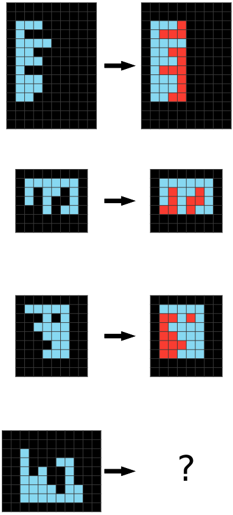

##### Watching the Network Learn (Problem 6d75e8bb)

**After 50 steps of training:**

The average of sampled outputs shows that light blue pixels in the input are generally preserved in the output. However, black pixels in the input are haphazardly and randomly colored light blue and red. The network does not seem to know that the colored input/output pixels lie within some kind of bounding box, or that the bounding box is the same for the input and output grids.

**After 100 steps of training:**

The average of sampled outputs shows red pixels confined to an imaginary rectangle surrounding the light blue pixels. The network seems to have perceived that other examples use a common bounding box for the input and output pixels, but is not completely sure about where the boundary lies and what colors go inside the box in the output.

**After 150 steps of training:**

The average of sampled outputs shows almost all of the pixels in the imaginary bounding box to be colored red. The network has figured out the solution, and further training only refines the solution.

##### Solution Analysis (Problem 6d75e8bb)


All the tensors fall to zero information content during training, except for three tensors. From 600-1000 steps, we see the $(example, height, width, channel)$ tensor suffer a massive drop in information content, with no change in the outputted solution. We believe it was being used to identify the light blue pixels in the input, but this information then got memorized by the nonlinear portions of the network, using the $(example, height, channel)$ and $(example, width, channel)$ as positional encodings.

We can look at the average output of the [decoding layer](#decoding-layer) for these tensors to see what information is stored there.

###### (Examples, height, channel) tensor:

The first principal component is 771 times stronger than the second principal component. **A brighter pixel indicates a row with more light blue pixels.** It is unclear how the network knows where the borders of the bounding box are.

###### (Examples, width, channel) tensor:

The first principal component is 550 times stronger than the second principal component. **A darker pixel indicates a column with more light blue pixels.** It is unclear how the network knows where the borders of the bounding box are.

###### (Color, channel) tensor:
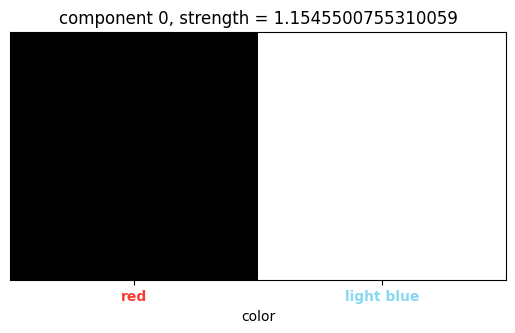
This tensor serves to distinguish the roles of the two colors apart.

### Case Study: Problem 41e4d17e

Problem 41e4d17e is part of the training split.


Solution from our network:


##### Solution Analysis (Problem 41e4d17e)

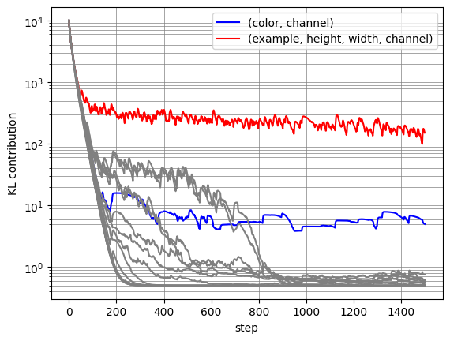
The only surviving tensors are the $(color, channel)$ and $(example, height, width, channel)$ tensors.
###### (Examples, height, width, channel) tensor:

The top principal component is 2496 times stronger than the second principal component. **The $(examples, height, width, channel)$ tensor codes for the locations of the centers of the blue squares.** In the KL contribution plot, we can see that the information content of this tensor is decreasing over time. Likely, the network is in the process of eliminating the plus shaped representation, and replacing it with a pixel instead, which takes less space.

###### (Color, channel) tensor:
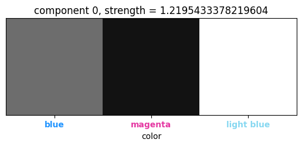
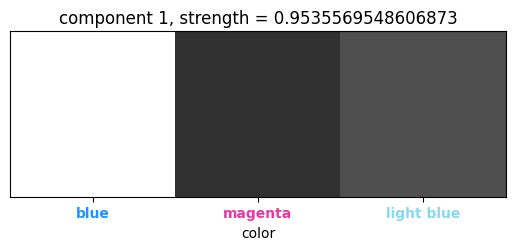
The $(color, channel)$ tensor just serves to distinguish the individual roles of the colors in the task.

## List of Mentioned ARC-AGI Tasks

All the problems we mentioned are part of the training split.

| Name     | Problem                   | Name     | Problem                   |
| -------- | ------------------------- | -------- | ------------------------- |
| 025d127b |  | 0a938d79 |  |
| 0ca9ddb6 |  | 0d3d703e |  |
| 0dfd9992 | 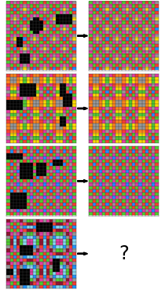 | 0e206a2e |  |
| 1c786137 |  | 1f876c06 |  |
| 28e73c20 |  | 272f95fa |  |
| 2bcee788 |  | 2dd70a9a |  |
| 3bd67248 |  | 41e4d17e |  |
| 42a50994 |  | 5ad4f10b |  |
| 6d75e8bb |  | 7b6016b9 |  |
| ce9e57f2 |  |          |                           |

## Code

Code for this project is available [here](https://github.com/iliao2345/CompressARC).

If you'd like to cite this blog post, use the following entry:
```
@online{liao2025arcagiwithoutpretraining,
	author = {Isaac Liao and Albert Gu},
	title = {ARC-AGI Without Pretraining},
	year = {2025},
	url = {https://yourblog.com/post-url},
}
```


[^19]: The two masks for the input and output are combined together to make one mask for use in these operations, since the channel dimension in these operations don't necessarily correspond to the input and output grids.

---


TODO: upload duplicated run results to repo. Do non-directional experiment.
TODO: add back to top links
TODO: fix headers
TODO: fix image-to-next-line spacing

TODO: make sure links work. Click on all of them.
TODO: fix the list numbering
TODO: blog post citation bibtex url
TODO: test installation instructions once public
TODO: update release date

Albert comments/notes:
- top down explanation
- start from highest level thesis before going into details (teaser figure before maybe)
